BMP280
====

BMP280是一种绝对气压传感器，专为移动应用而设计。
传感器模块封装在一个非常紧凑的包中。
它的小尺寸和低功耗允许手机、GPS模块或手表等电池供电设备的实现。

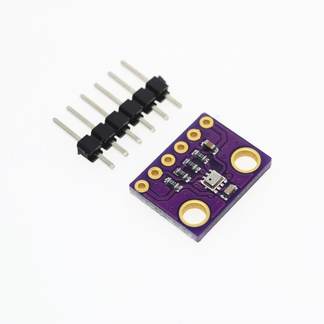

## 1. 规格
略

## 2. 绝对最大额定值
略

## 3. 功能说明
BMP280由压阻式压力传感元件和混合信号ASIC组成。
ASIC执行A/D转换，并通过数字接口提供转换结果和传感器特定的补偿数据。

BMP280为设计人员提供了很大的灵活性，可以通过寄存器设置适应精度，测量时间和功耗。

BMP280可以在三种模式下运行（见第3.6章）：
- 睡眠模式
- 一般模式
- 强制模式

在睡眠模式下，不执行任何测量。
正常模式包括在活动测量时段和非活动待机时段之间的自动永久循环。
在强制模式下，执行单次测量。
测量完成后，传感器返回睡眠模式。

采样设置提供了从超低功率到超高分辨率的设置，以使传感器适应不同的目标应用。
压力和温度测量采样精度可以独立选择0到16倍（见第3.3.1和3.3.2章）：
- 温度测量
- 超低功耗
- 低功耗
- 标准分辨率
- 高分辨率
- 超高分辨率

BMP280配有内置IIR滤波器，以最大限度地减少因门或窗户猛烈撞击而导致的输出数据短期干扰。
滤波器系数范围从0（关闭）到16。

为了简化设备使用并减少功率模式、过采样率和滤波器设置的大量可能组合，
Bosch Sensortec为智能手机，移动气象站或飞行玩具中的常见用例提供了经过验证的一系列建议（参见第3.4章）：
- 手持设备低功耗（例如运行Android的智能手机）
- 手持设备动态（例如运行Android的智能手机）
- 天气监测（功耗最低的设置）
- 电梯、楼层变化检测
- 下降检测
- 室内导航

### 3.1 框图
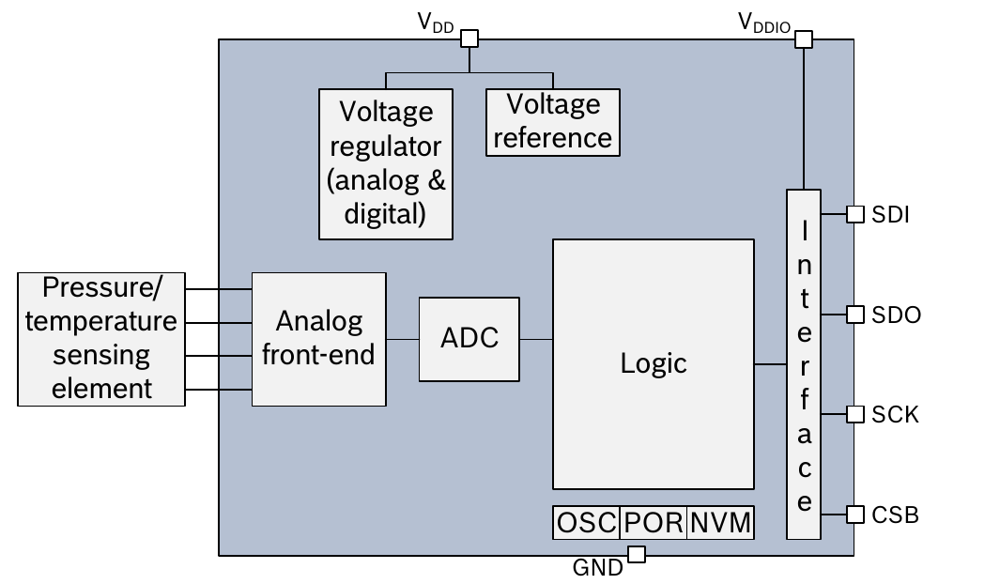

### 3.2 电源管理
BMP280有两个独立的电源引脚。
- VDD是所有内部模拟和数字功能模块的主电源
- VDDIO是一个独立的电源引脚，用于提供数字接口

内置上电复位发生器，在上电序列后复位逻辑电路和寄存器值。
对斜率和提高VDD和VDDIO电平的顺序没有限制。 上电后，传感器将进入睡眠模式（参见3.6.1）。

**警告: 当VDDIO关闭时，将任何接口引脚（SDI，SDO，SCK或CSB）保持在逻辑高电平可能会因过量电流流过ESD保护二极管而永久损坏器件。**

如果VDDIO已供电，但VDD未供电，则接口引脚保持在高阻态。
因此，在建立BMP280 VDD电源之前，总线可以自由使用。

### 3.3 测量过程
BMP280测量周期包括温度和压力测量，可选择采样精度。
在测量周期之后，数据通过可选的IIR滤波器，其消除了压力的短期波动（例如，由砰击门引起的）。流程如下图所示：
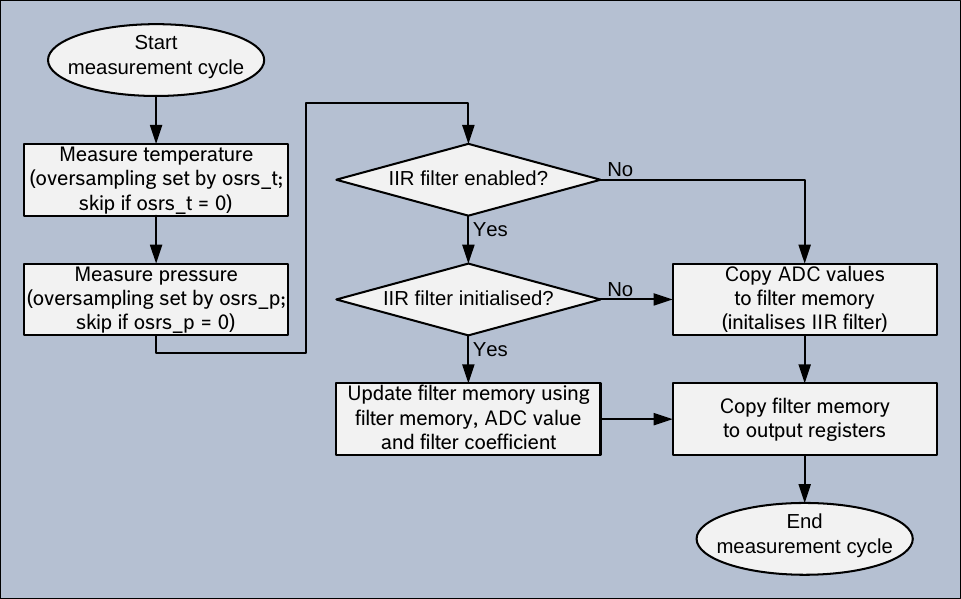

上图中的各个块将在以下子章节中详细说明。

#### 3.3.1 压力测量
可以启用或跳过压力测量。
如果将BMP280用作温度传感器，则跳过测量可能很有用。
启用后，会存在多个过采样选项。
每个过采样步骤都会降低噪声并将输出分辨率提高一位，存储在XLSB数据寄存器0xF9中。
通过控制寄存器0xF4中的osrs_p[2:0]位选择启用/禁用测量和采样设置。

| 过采样设置 | 压力过采样 | 典型压力分辨率 | 推荐的温度过采样 |
|----------|-----------|----|-----|
| 跳过压力测量 | 跳过（输出设置为0x80000） | - | 根据需要 |
| 超低功耗 | x1 | 16bit/2.62Pa | x1 |
| 低功耗 | x2 | 17bit/1.31Pa | x1 |
| 一般分辨率 | x4 | 18bit/0.66Pa | x1 |
| 高辨率 | x8 | 19bit/0.33Pa | x1 |
| 超高辨率 | x16 | 20bit/0.16Pa | x2 |

要找到适合osrs_p的设置，请参阅第3.4章。

#### 3.3.2 温度测量
温度测量可以启用或跳过。
跳过测量可能非常有助于非常快速地测量压力。
启用后，会存在多个过采样选项。
每个过采样步骤都会降低噪声并将输出分辨率提高一位，存储在XLSB数据寄存器0xFC中。
通过控制寄存器0xF4中的osrs_t[2:0]位选择启用/禁用温度测量和过采样设置。

| osrs_t[2:0] | 温度过采样 | 典型温度分辨率 |
|--|--|--|
| 000 | 跳过（输出设置为0x80000） | - |
| 001 | x1 | 16bit/0.0050°C |
| 010 | x2 | 17bit/0.0025°C |
| 011 | x4 | 18bit/0.0012°C |
| 100 | x8 | 19bit/0.0006°C |
| 101, 110, 111 | x16 | 20bit/0.0003°C |

建议根据上表将osrs_t的值基于所选的osrs_p值。
温度过采样可能高于x2，但不会进一步显着提高压力输出的精度。
其原因在于补偿压力值的噪声更多地取决于原始压力而不是原始温度噪声。
遵循推荐的设置将产生最佳的噪声功率比。

#### 3.3.3 IIR滤波器
环境压力会受到许多短期变化的影响，例如通过砰击门或窗户，或吹入传感器的风。
为了抑制输出数据中的这些干扰而不会导致额外的接口流量和处理器工作负载，BMP280具有内部IIR滤波器。
它有效地降低了输出信号的带宽。
测量的下一个步骤是将输出使用以下公式进行过滤：

其中data_filtered_old是来自上一次采集的数据，和data_ADC是IIR滤波之前来自ADC的数据。

可以使用控制寄存器0xF5中的filter[2:0]位配置IIR滤波器，具体如下：

| 滤波系数 | Samples to reach ≥ 75%   of step response |
|:-:|:-:|
| 关闭滤波 | 1 |
| 2 | 2 |
| 4 | 5 |
| 8 | 11 |
| 16 | 22 |

要找到合适的过滤器设置，请参阅第3.4章。

写入滤波器寄存器时，滤波器复位。
下一个值将通过过滤器并成为过滤器的初始内存值。
如果跳过温度或压力测量，即使输出寄存器设置为0x80000，相应的滤波器存储器也将保持不变。
当重新启用先前跳过的测量时，将从上次未跳过测量时使用过滤器存储器过滤输出。

### 3.4 滤波器选择
为了选择最佳设置，建议使用以下用例：

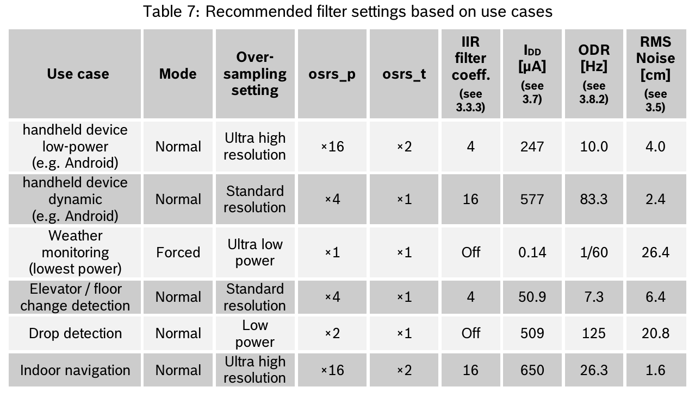

### 3.5 噪声
噪声取决于所选的过采样和滤波器设置。
所述值在受控压力环境中确定，并且基于在最高采样速度下获得的32个连续测量点的平均标准偏差。
这是为了排除噪声测量的长期漂移所必需的。

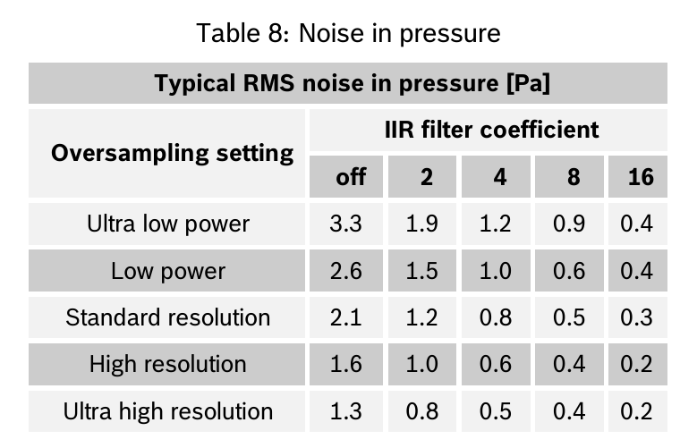

### 3.6 电源模式
BMP280提供三种电源模式：睡眠模式，强制模式和普通模式。 可以使用控制寄存器0xF4中的模式[1:0]位选择这些位。

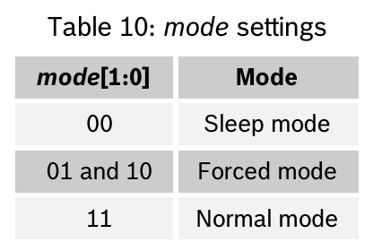

#### 3.6.1 睡眠模式
上电复位后默认设置睡眠模式。 在睡眠模式下，不执行任何测量并且功耗最小。
所有寄存器均可访问，可以读取芯片ID和补偿系数。

#### 3.6.2 强制模式
在强制模式下，根据所选的测量和滤波器选项执行单次测量。
测量完成后，传感器返回睡眠模式，测量结果可从数据寄存器中获得。
对于下一次测量，需要再次选择强制模式。
这类似于BMP180操作。 对于要求低采样率或基于主机的同步的应用，建议使用强制模式。

#### 3.6.3 正常模式
正常模式在测量时段（有效）和待机时段（无效）之间不间断地循环，其时间由Tstandby定义。
待机时段中的电流略高于睡眠模式。
在设置模式、测量和滤波器选项后，可以从数据寄存器获得最后的测量结果，而无需进一步的写访问。
使用IIR滤波器时，建议使用正常模式，对于应过滤短期干扰（例如吹入传感器）的应用非常有用。

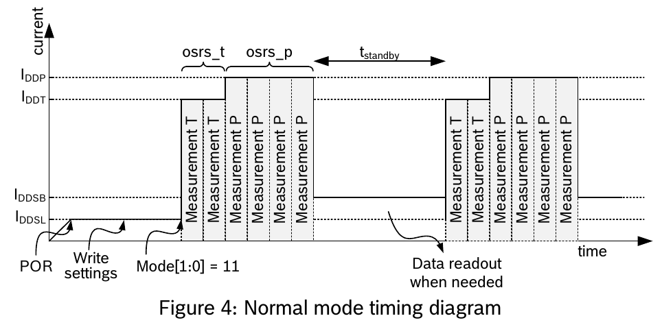

待机时间由控制寄存器0xF5中t_sb[2:0]位的内容决定，具体如下表所示：

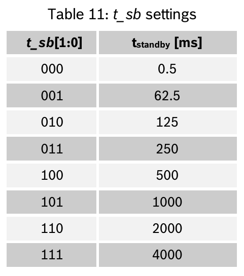

#### 3.6.4 模式转换图
支持的模式转换显示如下。

如果设备当前正在执行测量，则模式切换命令的执行被延迟直到当前运行的测量周期结束。
在执行最后一次模式更改命令之前，将忽略其他模式更改命令。
下面的转换过程是经过测试的，但不代表推荐使用。

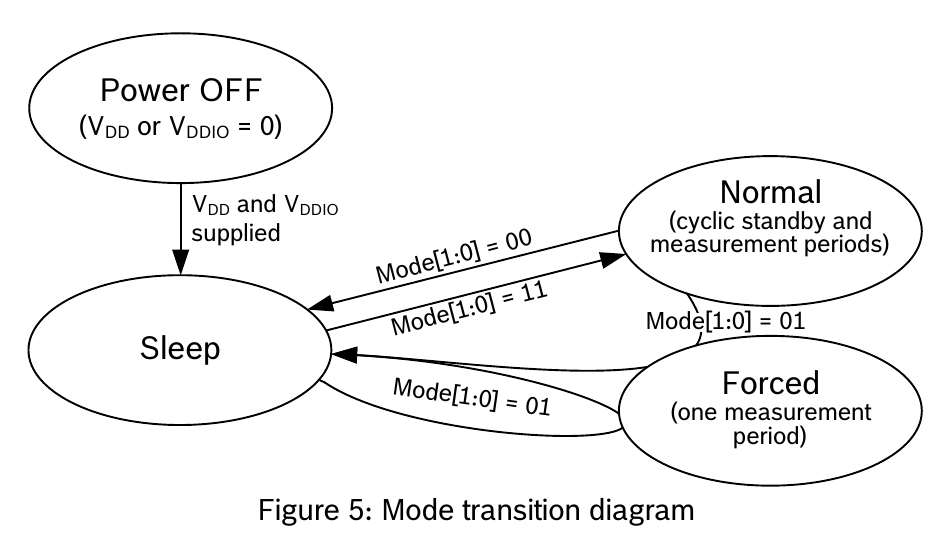

### 3.7 电流消耗
电流消耗取决于ODR和过采样设置。
下面给出的值归一化为1Hz的ODR。
给定ODR的实际消耗量可以通过将表12中的消耗量与所使用的ODR相乘来计算。
实际的ODR由用户设置强制测量的频率或表14中的正常模式下的过采样和Tstandby设置定义。

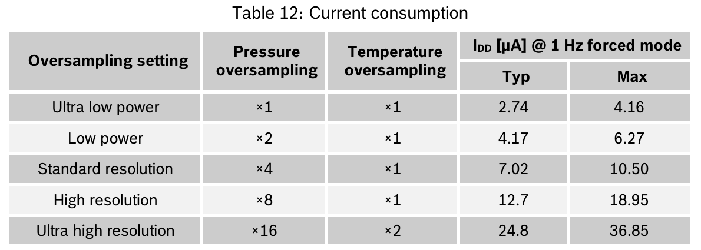

### 3.8 测量时间
在强制模式下执行测量的速率取决于过采样设置osrs_t和osrs_p。
它们在正常模式下执行的速率取决于过采样设置设置osrs_t和osrs_p以及待机时间Tstandby。
在下表中，仅为建议的osrs组合给出了所得的ODR。

#### 3.8.1 测量时间
下表根据所选的过采样设置说明了典型和最大测量时间。
可达到的最小频率由最大测量时间决定。

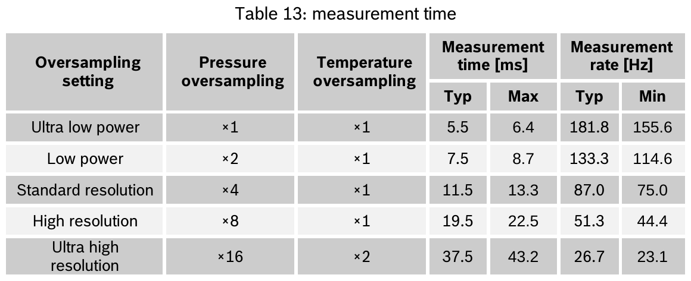

#### 3.8.2 正常模式下的测量速率
下表说明了基于过采样设置和Tstandby在正常模式下可以预期的测量速率。

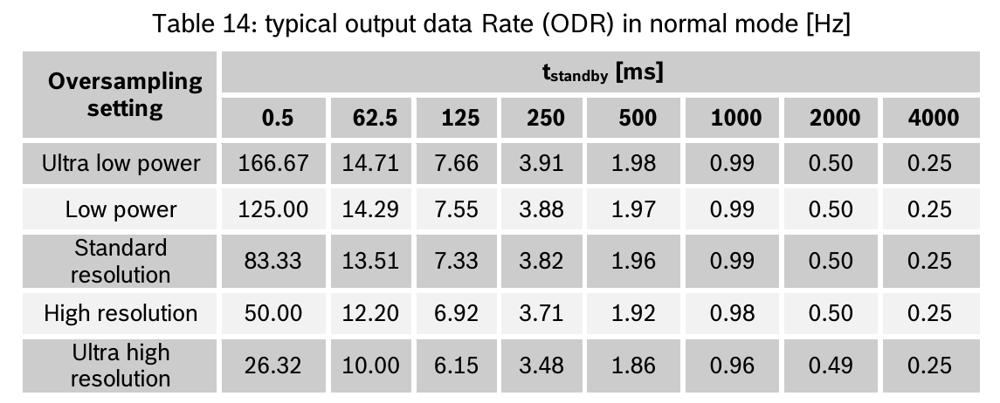

### 3.9 数据读取
要在转换后读出数据，强烈建议使用突发读取，而不是单独寻址每个寄存器。
这将防止可能混淆属于不同测量的字节并减少接口流量。
通过启动从0xF7到0xFC的突发读取来完成数据读出。
对于压力和温度，数据以无符号20位格式读出。
强烈建议使用Bosch Sensortec提供的BMP280 API进行读数和补偿。
有关存储器映射和接口的详细信息，请分别参阅第3.12和第5章。

应该在强制模式下进行数据读出的时序，以便遵守最大测量时间（见第3.8.1章）。
在正常模式下，读数可以以与预期数据输出速率相似的速度完成（参见第3.8.2章）。
读取'ut'和'up'的值后，需要使用存储在设备中的补偿参数计算实际压力和温度。
该程序在第3.11章详述。

### 3.10 影子数据寄存器
在正常模式下，测量定时不一定与读出同步。
这意味着当用户正在读取先前测量的结果时，可以获得新的测量结果。
在这种情况下，执行影子操作以保证数据一致性。
仅当在单个突发读取中读取所有数据寄存器时，影子才有效。
因此，如果用户不将数据读出与测量周期同步，则用户必须使用突发读取。
使用多个独立的读命令可能会导致数据不一致。

如果完成新测量并且仍在读取数据寄存器，则新的测量结果将传输到影子数据寄存器中。
一旦用户结束突发读取，即使并非所有数据寄存器都被读取，影子寄存器的内容也会被传输到数据寄存器中。
因此，如果使用单个突发读取命令，则只能保证在一个测量周期内读取多个数据寄存器。
在SPI情况下，通过CSB引脚的上升沿或在I2C情况下识别停止条件来标记突发读取的结束。
在突发读取结束后，会立即更新所有用户数据寄存器。

### 3.11 输出补偿
BMP280输出由ADC输出值组成。
但是，每个传感元件的行为都不同，必须使用一组校准参数计算实际压力和温度。
第3.11.3章中的推荐计算使用定点算术。
在MatlabTM或LabVIEWTM等高级语言中，可能无法很好地支持定点代码。
在这种情况下，附录8.1中的浮点代码可以用作替代方案。
对于8位微控制器，变量大小可能是有限的。
在这种情况下，附录8.2给出了精度降低的简化32位整数代码。

#### 3.11.1 计算要求
略

#### 3.11.2 微调参数读数
微调参数在生产过程中被编程到设备的非易失性存储器（NVM）中，并且不能由客户更改。
每个补偿字都是以二进制补码存储的16位有符号或无符号整数值。
由于存储器被组织成8位字，因此必须始终组合两个字节以表示补偿字。
8位寄存器命名为calib00 ... calib25，存储在存储器地址0x88 ... 0xA1。
对于温度补偿相关值，相应的补偿字被命名为dig_T＃，对于压力补偿相关值，相应的补偿字被命名为dig_P＃。映射如表17所示。

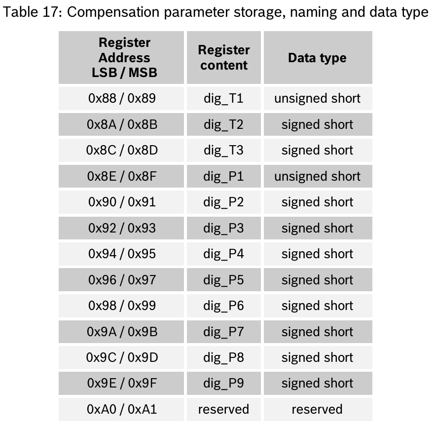

#### 3.11.3 补偿公式
请注意，强烈建议使用Bosch Sensortec提供的API来执行读数和补偿。
如果不需要，可以应用以下代码，用户可能会面临风险。
预期压力和温度值都以20位格式接收，为正数，存储在32位有符号整数中。

变量t_fine（带符号32位）将精细分辨率温度值传递给压力补偿公式，并且可以实现为全局变量。

数据类型“BMP280_S32_t”应定义32位有符号整数变量类型，通常可以定义为“long signed int”。

数据类型“BMP280_U32_t”应定义32位无符号整数变量类型，通常可以定义为“long unsigned int”。

为了获得最佳计算精度，需要64位整数支持。 如果您的平台无法做到这一点，请参阅附录8.2了解32位替代方案。

数据类型“BMP280_S64_t”应定义64位有符号整数变量类型，在大多数支持平台上可以将其定义为“long long signed int”。

代码的修订版是rev.1.1。

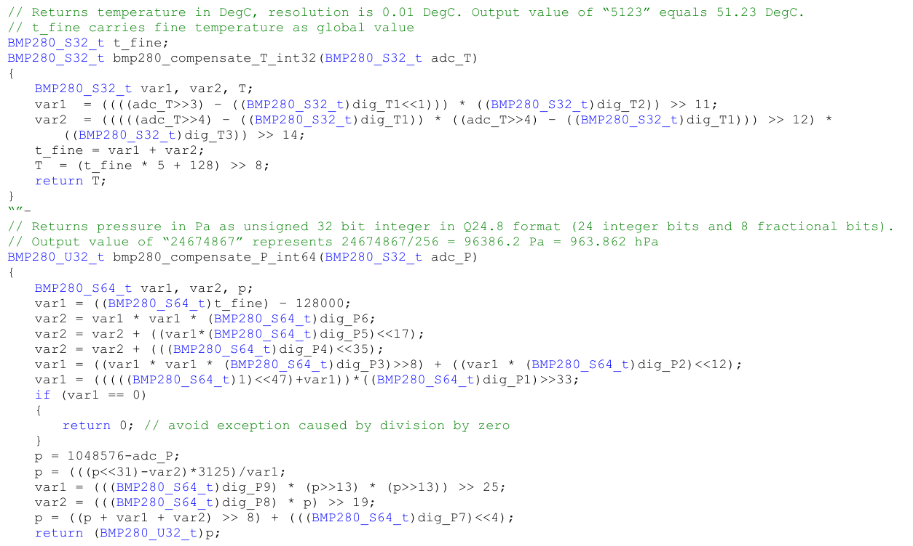

### 3.12 计算压力和温度
下图显示了压力和温度测量的详细算法。
该算法可作为Bosch Sensortec的参考C源代码（“BMP28x_ API”）以及其销售和分销合作伙伴提供给客户。

**有关详细信息，请联系您的Bosch Sensortec代表。**

_详细部分请参考英文文档_

## 4. 全局存储器映射和寄存器描述
### 4.1 通用信息
通过读取和写入寄存器来执行与器件的所有通信。
寄存器的宽度为8位。
有几个寄存器是保留的，它们不应该被写入，并且在阅读时没有保证具体的价值。
有关接口的详细信息，请参阅第5章。

### 4.2 存储器映射
存储器映射在下面的表18中给出。保留寄存器未显示。

### 4.3 寄存器描述
#### 4.3.1 ID寄存器 0xD0
“id”寄存器包含芯片标识号chip_id[7:0]，即0x58。
一旦器件完成上电复位，就可以读取该数字。

#### 4.3.2 RESET寄存器 0xE0
“reset”寄存器包含软件复位字节reset[7：0]。
如果将值0xB6写入寄存器，则使用完整的上电复位程序复位器件。
写入除0xB6之外的其他值无效。
读数值始终为0x00。

#### 4.3.3 STATUS寄存器 0xF3
“status”寄存器包含两个位，用于指示器件的状态。

- Bit 3: 转换运行时自动设置为“1”，结果传输到数据寄存器后自动设置为“0”。
- Bit 0: 将NVM数据复制到镜像寄存器时自动设置为“1”，复制完成后自动设置为“0”。数据在上电复位时和每次转换前复制。

#### 4.3.4 CTRL_MEAS寄存器 0xF4
“ctrl_meas”寄存器设置设备的数据采集选项。

| CTRL_MEAS | 名称 | 描述 |
|-|-|-|
| Bit 7、6、5 | osrs_t[2:0] | 控制温度数据的过采样。 有关详细信息，请参见第3.3.2章 |
| Bit 4、3、2 | osrs_p[2:0] | 控制压力数据的过采样。 有关详细信息，请参见第3.3.1章 |
| Bit 1、0 | mode[1:0] | 控制设备的电源模式。 详情请参见第3.6章 |

| osrs_p[2:0] | 压力数据过采样 |
|-|-|
| 000 | 跳过 |
| 001 | oversampling x 1 |
| 010 | oversampling x 2 |
| 011 | oversampling x 4 |
| 100 | oversampling x 8 |
| 101及其他 | oversampling x 16 |

| osrs_t[2:0] | 温度过采样 |
|-|-|
| 000 | Skipped (output set to 0x80000) |
| 001 | oversampling ×1 |
| 010 | oversampling ×2 |
| 011 | oversampling ×4 |
| 100 | oversampling ×8 |
| 101, 110, 111 | oversampling ×16 |

#### 4.3.5 CONFIG寄存器 0xF5
“config”寄存器设置设备的速率，过滤器和接口选项。
在正常模式下写入“config”寄存器可能会被忽略。
在睡眠模式下，写入不会被忽略。

#### 4.3.6 PRESS寄存器 0xF7...0xF9(_msb, _lsb, _xlsb)
“press”寄存器包含原始压力测量输出数据 up[19:0]。
有关如何从设备读取压力和温度信息的详细信息，请参阅第3.9章。

#### 4.3.7 TEMP寄存器 0xFA...0xFC(_msb, _lsb, _xlsb)
“temp”寄存器包含原始温度测量输出数据 ut[19:0]。
有关如何从设备读取压力和温度信息的详细信息，请参阅第3.9章。

## 5. 数字接口
BMP280同时支持IIC和SPI接口。
在两种协议中它均作为从设备存在。

IIC模式下支持标准、快速和高速模式。

SPI模式下兼容工作模式0(CPOL=CPHA=0)和工作模式3(CPOL=CPHA=1)。

BMP280支持以下事务：
- 单字节写入
- 多字节写（使用寄存器地址和寄存器数据对）
- 单字节读取
- 多字节读取（使用自动递增的单个寄存器地址）

### 5.1 接口选择
根据CSB（芯片选择）状态自动完成接口选择。
如果CSB连接到VDDIO，则I²C接口有效。 如果CSB被下拉，则SPI接口被激活。
在CSB下拉一次后（无论是否发生任何时钟周期），I²C接口被禁用，直到下一次上电复位。
这样做是为了避免无意中将SPI流量解码为另一个从机作为I²C数据。
由于上电复位仅在VDD和VDDIO都建立时执行，因此不存在因使用上电序列而导致协议检测错误的风险。
但是，如果要使用I²C且CSB没有直接连接到VDDIO，而是通过可编程引脚连接，则必须确保该引脚在器件上电复位期间已经输出VDDIO电平。
如果不是这种情况，器件将锁定在SPI模式，不响应I²C命令。

### 5.2 IIC接口
IIC从接口与飞利浦IIC规范2.1版兼容。有关详细时序，请参阅表27。
支持所有模式（标准，快速，高速）。
SDA和SCL不是纯粹的漏极开路。
两个焊盘都包含VDDIO和GND的ESD保护二极管。
由于器件不执行时钟延长，SCL结构是高Z输入，没有漏极能力。

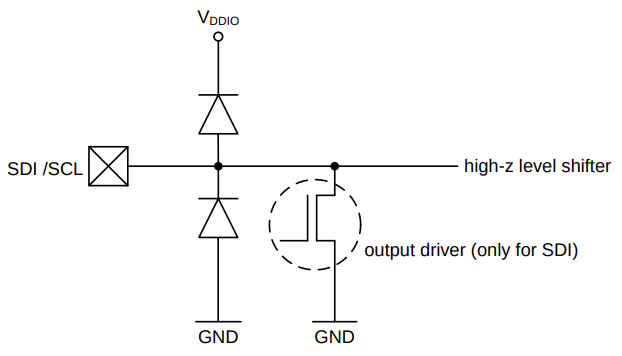

7位器件地址为111011x，6个MSB位是固定的。
最后一位可通过SDO值更改，并可在操作期间更改。
将SDO连接到GND会产生从机地址1110110（0x76），
连接到VDDIO产生从地址1110111（0x77），这与BMP180的I2C地址相同。
SDO引脚不能悬空，如果悬空，则I2C地址将不确定。

I2C接口使用以下引脚：
- SCK：串行时钟（SCL）
- SDI：数据（SDA）
- SDO：从机地址LSB（GND ='0'，VDDIO ='1'）

CSB必须连接到VDDIO才能选择IIC接口。
SDI是双向的，漏极开路到GND：它必须通过上拉电阻外部连接到VDDIO。
有关连接说明，请参阅第6章。

以下缩写将用于I2C协议图：
- S 开始
- P 停止
- ACKS   从机确认
- ACKM   主机确认
- NACKM  主机不确认

#### 5.2.1 IIC写操作
通过在写模式下发送从地址（RW ='0'）来完成写操作，从而产生从机地址111011X0（'X'由SDO引脚的状态决定)。
然后主机发送成对的寄存器地址和寄存器数据。
发送停止信号以结束操作。这在图7中描述。

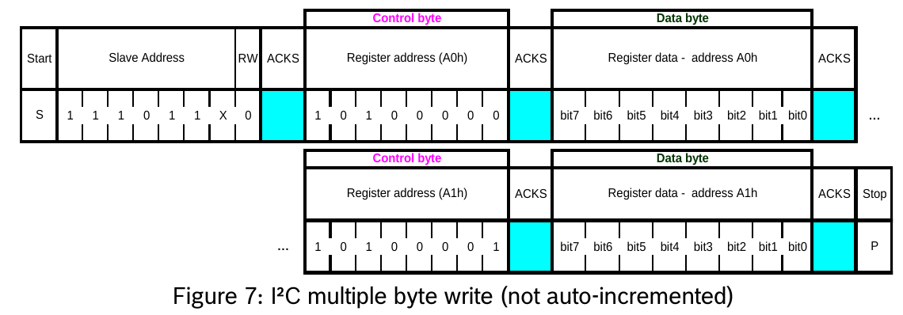

#### 5.2.2 IIC读操作
为了能够读取寄存器，首先必须以写模式发送寄存器地址（从地址111011X0）。
然后必须生成停止或重复启动条件。
在此之后，从器件在地址111011X1处以读取模式（RW =“1”）寻址，之后从器件从自动递增的寄存器地址发送数据，直到发生NOACKM和停止条件。
这在图8中描述，其中从寄存器0xF6和0xF7读取两个字节。

### 5.3 SPI接口
略

### 5.4 接口参数规范
#### 5.4.1 通用接口参数
通用界面参数在下表26中给出。

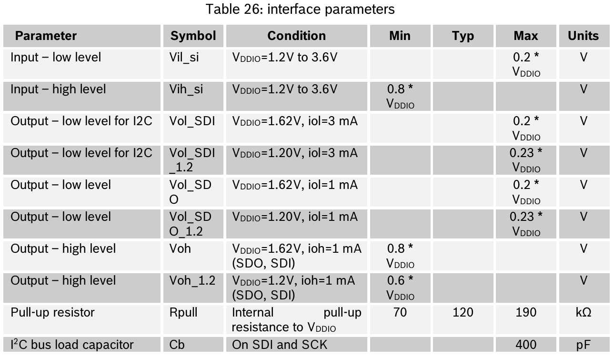

#### 5.4.2 IIC时序
对于IIC时序，使用以下缩写：
- “S&F mode” 标准和快速模式
- “HS mode” 高度模式
- Cb SDA线上的总线电容

所有其他命名均参考I2C规范2.1（2000年1月）。

I2C时序图如图12所示。相应的值在表27中给出。

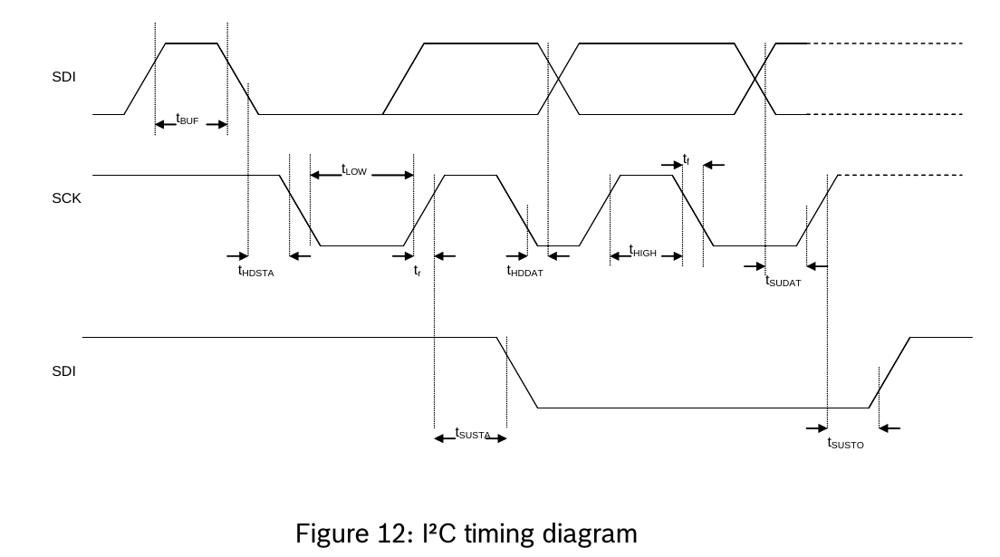

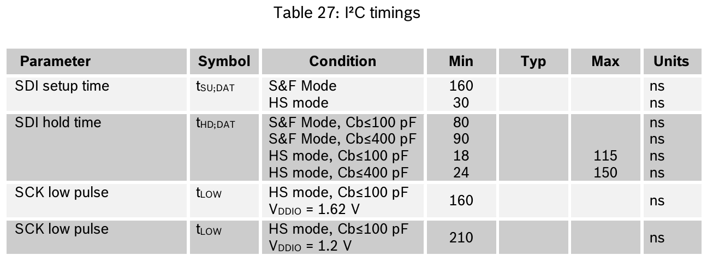

上述IIC特定时序对应于以下内部增加的延迟：
- SDI和SCK输入之间的输入延迟：在标准和快速模式下，SDI通常比SCK延迟100ns，在高速模式下通常为20ns。
- 在标准和快速模式下，从SCK下降沿到SDI输出传播的输出延迟通常为140ns，在高速模式下通常为70ns。

#### 5.4.3 SPI时序
略

## 6. 引脚和连接图
略

## 7. 封装
略

## 8. 附录1：32位系统的计算公式
略

## 9. 法律免责声明
略

## 10. 文档历史版本和变更
略